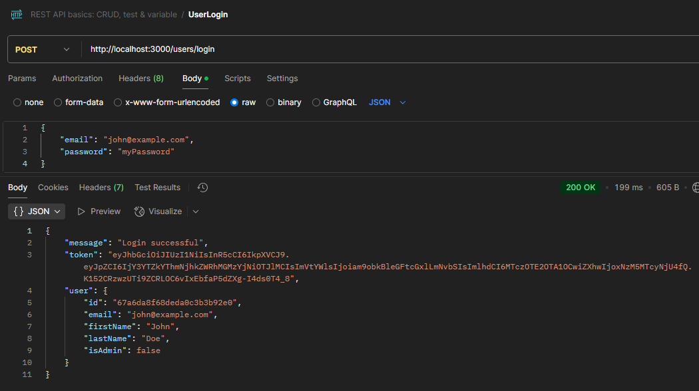
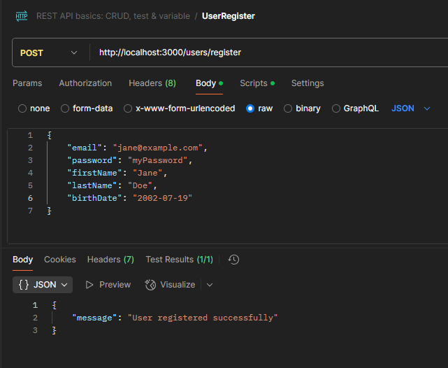

### Flat Finder Server Side (Node)

## Technologies

- Server - Node, Express
- Database - MongoDB, Mongoose
- Test - Postman
- Security - JasonWebToken(JWT), Bcrypt.js

## User

### Get all users

Route: "/users"
Request: GET
Example:

### Get user by id

Route: "/users/:id"
Request: GET
Example:

### Update user

Route: "/users/:id"
Request: PATCH
Example:

### Delete user

Route: "/users/register"
Request: DELETE
Example:

### Login

Route: "/users/login"
Request: POST
Example:

### Register

Route: "/users/register"
Request: POST
Example:

## Flat

### Get all flats

Route: "/flats"
Request: GET
Example:

### Update flat

Route: "/flats/:id"
Request: PATCH
Example:

### Delete flat

Route: "/flats/:id"
Request: DELETE
Example:

### Add flat

Route: "/flats"
Request: POST
Example:

### Get flat by id

Route: "/flats/:id"
Request: GET
Example:

## Message

### Get all messages

Route: "/flats/:id/messages"
Request: GET
Example:

### Get user messages

Route: "/flats/:id/messages/:senderId"
Request: GET
Example:

### Add message

Route: "/flats/:id/messages"
Request: POST
Example:

