### Flat Finder Server Side (Node)

## Technologies

- Server - Node, Express
- Database - MongoDB, Mongoose
- Test - Postman
- Security - JasonWebToken(JWT), Bcrypt.js

## Using Postman to Test API Requests

Postman is a tool that allows you to send HTTP requests to your API for testing. Follow these steps to make requests correctly.

### 1. Set up postman

1. Open Postman and create a new request.
2. Select the appropiate HTTP method (GET, POST, PATCH, DELETE, etc.).
3. Enter the API endpoint URL (e.g. http://localhost:3000/users).

### 2. Add Authorization Header (JWT)

For most requests, authentication is required using a JWT (JSON Web Token).

Go to the "Headers" tab.
Add a new key-value pair:
Key: Authorization
Value: Bearer <your-jwt-token>
(Replace <your-jwt-token> with a valid token obtained from the login response.)

## User

### Get all users

Route: "/users"
Request: GET
Example:
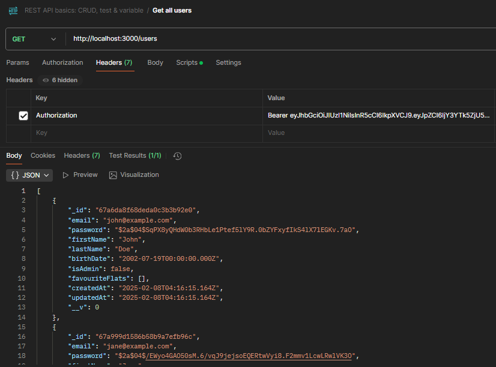

### Get user by id

Route: "/users/:id"
Request: GET
Example:
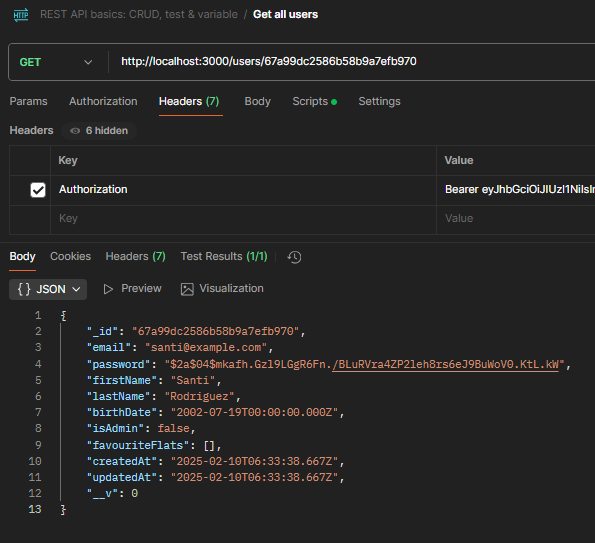

### Update user

Route: "/users/:id"
Request: PATCH
Example:
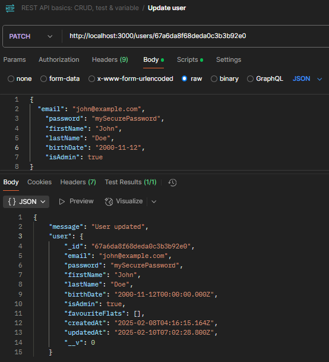

### Delete user

Route: "/users/register"
Request: DELETE
Example:
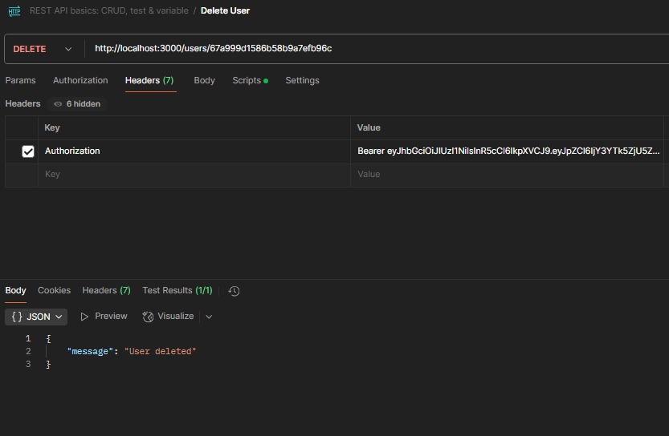

### Login

Route: "/users/login"
Request: POST
Example:
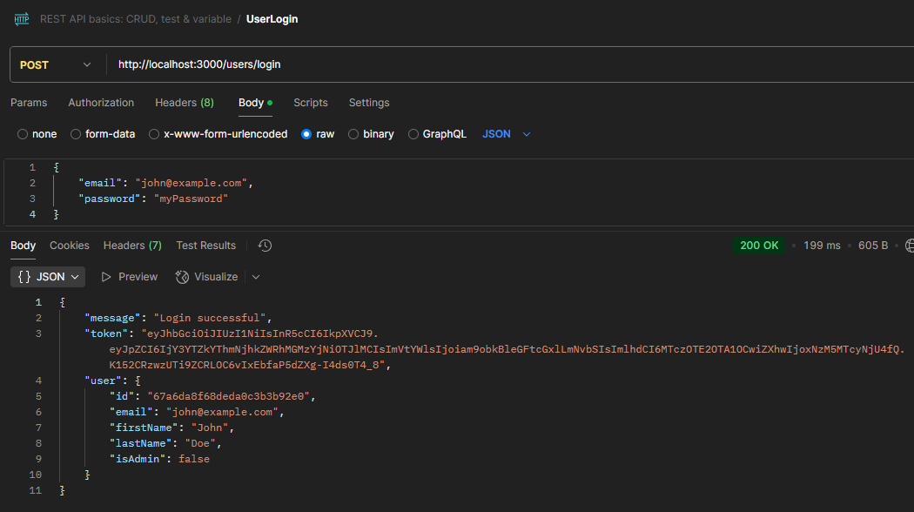

### Register

Route: "/users/register"
Request: POST
Example:

## Flat

### Get all flats

Route: "/flats"
Request: GET
Example:
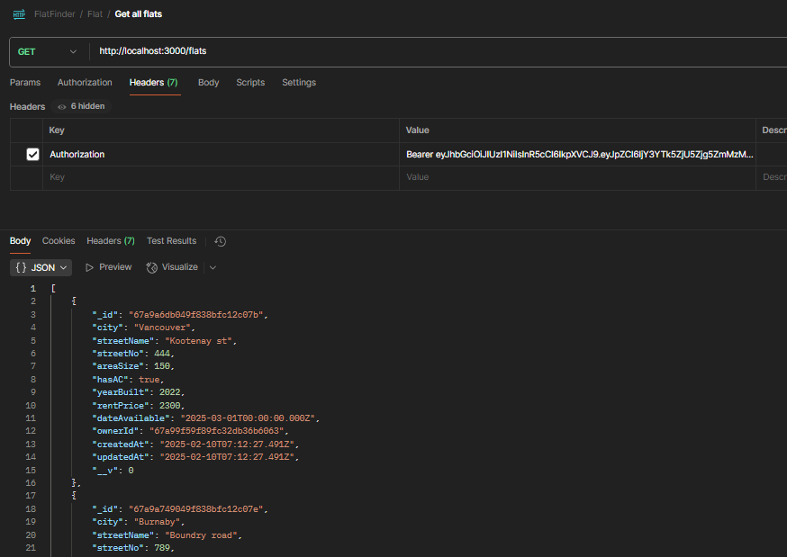

### Update flat

Route: "/flats/:id"
Request: PATCH
Example:
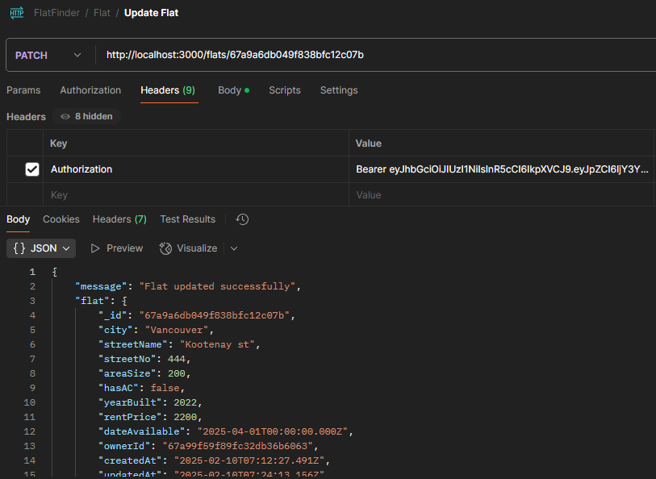

### Delete flat

Route: "/flats/:id"
Request: DELETE
Example:
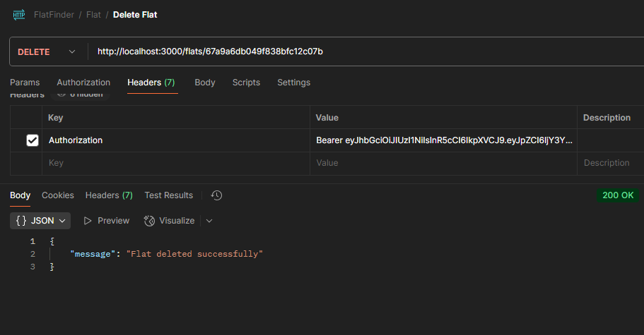

### Add flat

Route: "/flats"
Request: POST
Example:
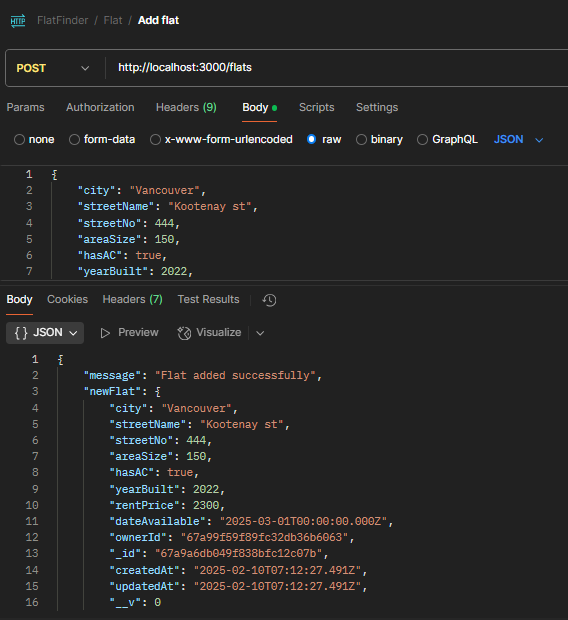

### Get flat by id

Route: "/flats/:id"
Request: GET
Example:
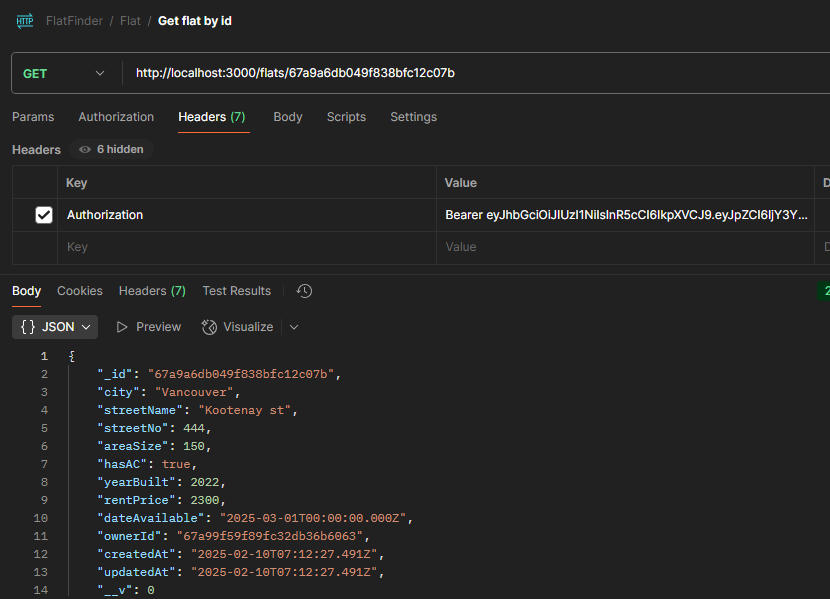

## Message

### Get all messages

Route: "/flats/:id/messages"
Request: GET
Example:
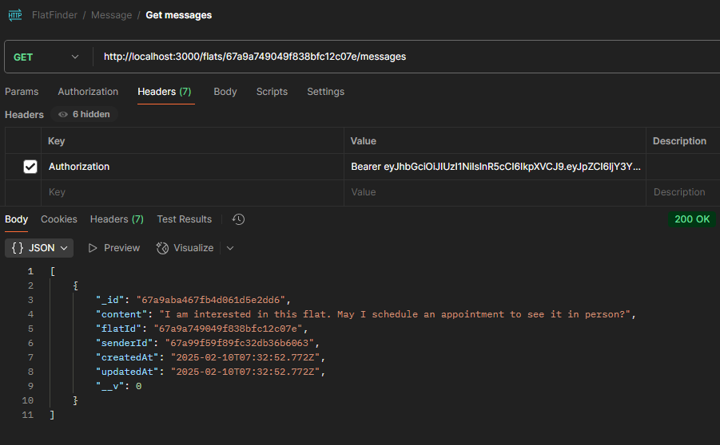

### Get user messages

Route: "/flats/:id/messages/:senderId"
Request: GET
Example:
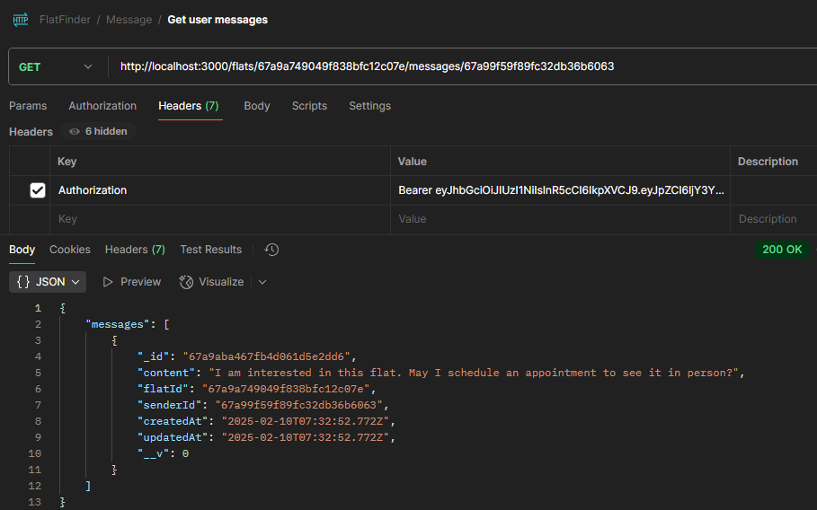

### Add message

Route: "/flats/:id/messages"
Request: POST
Example:
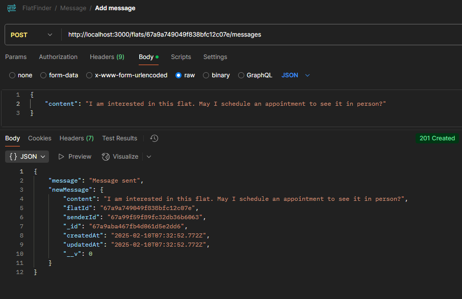
